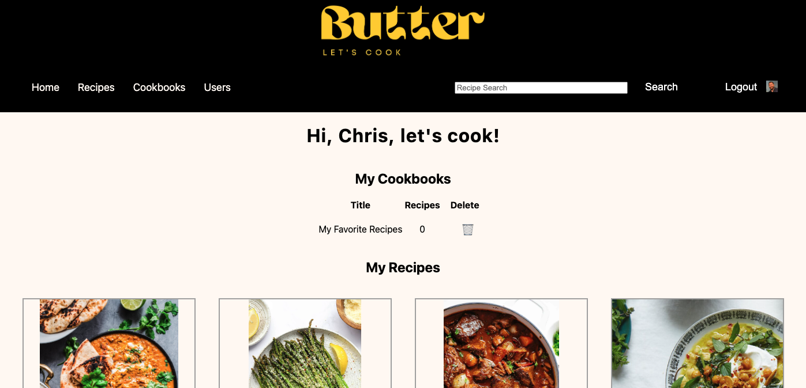

video from 
# Butter

## [Use Butter Here](https://butterapp.fly.dev/)

Butter is inspired by my love of cooking. As a home cook, I'm always searching online for the best recipes. When I find a great recipe and cook it over and over again, I usually end up tweaking the recipe over time. I don't have a paper cookbook in my kitchen to keep notes in, so I usually end up forgetting exactly what I tweaked to make the recipe even better.

Butter is an online cookbook app that lets you search, save, and copy recipes that you can edit and leave notes on over time. No more scrolling Google hoping to come across that recipe you made last year. No more guessing on if you used 2 or 3 tablespoons of turmeric in that curry you love. Keeping track of your favorite recipes is as easy as Butter.

Planning materials and original wireframes can be found [here](https://trello.com/b/l3p04IWp/butter-project-plan)

## Technologies Used
* Express
* Node.js
* Mongoose
* MongoDB
* Google OAuth
* EJS
* JavaScript
* HTML
* CSS
* Git
* Canva
* [Edamam API](https://www.edamam.com/)
* Cheerio
* Axios

## Credits
* Background video on login screen from [Polina Kovaleva](https://www.pexels.com/@polina-kovaleva/)
* Button styling inspiration from [CSS Scan](https://getcssscan.com/)
* Dropdown menu template from [CSS Tricks](https://css-tricks.com/)
* Web Scraping help from [Kevin Sahin](https://www.pexels.com/@polina-kovaleva/) at [ScrapingBee](https://www.scrapingbee.com/blog/web-scraping-javascript/)

## Ice Box
- [ ] Implement web-scraping a user can import a recipe without manually entering data - partially complete
- [ ] Add recipe categories for easier searching as the recipe database grows
- [ ] Only show original recipes in the user submitted recipes section
- [ ] Let users save a bio in their profile
